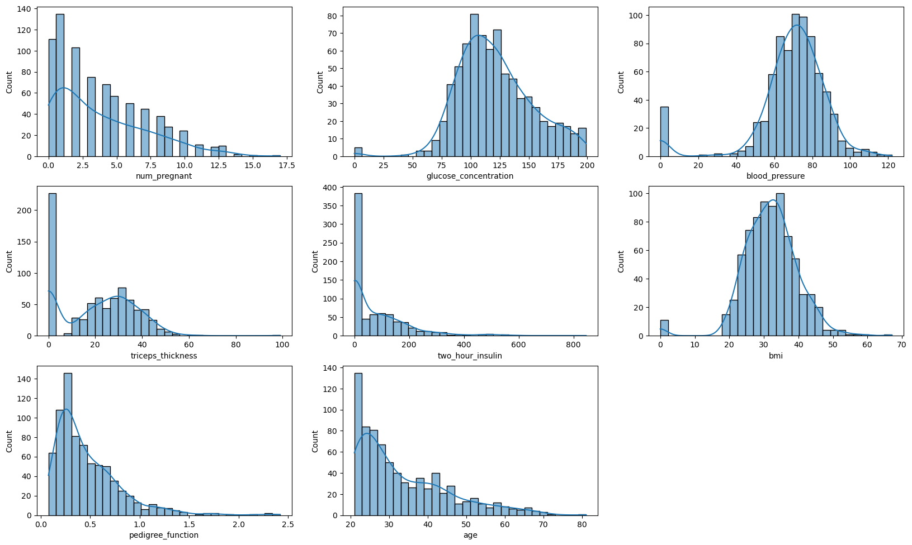
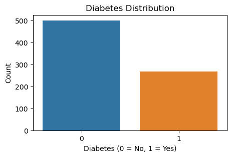
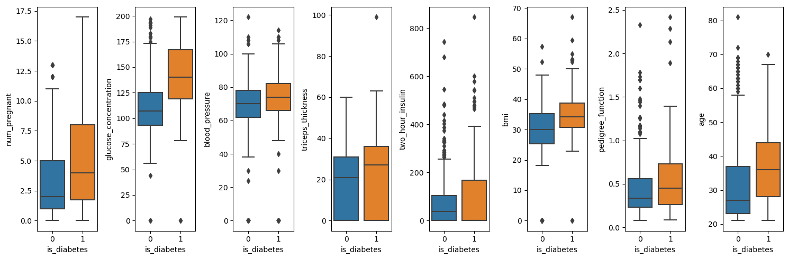
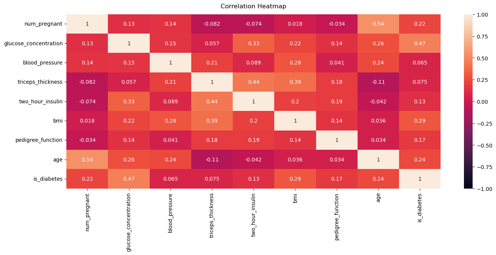

# Gestational Diabetes Prediction 
This study was conduct based on the data from [UCI Machine Learning](https://www.kaggle.com/datasets/uciml/pima-indians-diabetes-database?select=diabetes.csv) and aim to compare some algorithms for classifying the data. 

**Study Objective** : Developing Machine Learning model by Comparing some classification algorithms for detecting gestational diabetes with high recall to minimize miss treatment for patient

In this study, I try to make some scenarios to compare the algorithms, here are the scenarios:
- Modeling and compare algorithms for Imbalance Class 
- Modeling and compare algorithms for Balance Class
- Comparing the best algorithm from 2 scenarios above

Here are the outline of this project and the insights found in every section:

## A. Exploratory Data Analysis

This step will help for understanding more about the structure, patterns, amd relationships in dataset. 
This step is divided into some sections and for every section here I provide the insight I found
### Data Overview 
#### Insight
- Number of Column : 9
- Number of Entries : 786 
- Number of Missing Values : 0
- Name of Column:
    - `num_pregnant`            : the number of pregnancies the individual has had         
    - `glucose_concentration`   : the concentration of glucose in the individual's blood
    - `blood_pressure`          : the individual's blood pressure reading 
    - `triceps_thickness`       : the thickness of the individual's triceps skinfold, a measure of body fat
    - `two_hour_insulin`        : Insulin level in the individual's blood measured after 2 hours glucose test
    - `bmi`                     : the individual's Body Mass Index, measure of body fat based on height and weight
    - `pedigree_function`       : likelihood of the individual having diabetes based in familiy history
    - `age`                     : the individual's age
    - `is_diabetes`             : the target varibale, 1 indicating that the individual has diabetes, 0 otherwise. 

### Summary Statistics
This step helps me with brief understanding of the distribution, central tendency, and spread of the data
#### Insight
- `two_hour_insulin` feature has highest standard deviasion and this indicate that this feature has high variability or dispersion due to data points are widely spread out from the mean.
- `pedigree_function` feature has the lowest standard deviasion and this indicate that this feature has low variability or consistency in the data
- Feature such as `glucose_concentration`, `blood_pressure`, `triceps_thickness`, `two_hour_insulin`, `bmi` **cannot have** a value of **0**, this lead to replacing the 0 value in next preprocessing step 

### Distribution Analysis 
This step helps me to know more about the data distribution, in this step I tried to visualize the data 
#### Insight

**Univariate Analysis**

*Feature Distribution*

- `num_pregnant`, `predigree_function`, `two_hour_insulin`, `triceps_thickness`, and `age` features are not distributed normally and had right skwed distribution 
- `BMI`, `blood_pressure`, and `glucose_concentration` distributed normally

 
*Class Distribution*
- The data has 2 classes, 1 indicating that the individual has diabetes, 0 otherwise
- The class ditribution is Imbalance which is class 0 has more data compare to class 1 and the ratio is 2:1 

**Bivariate Analysis**

- `num_pregnant`: Judging from the boxplot, mothers who are pregnant 1-5 times have the same chance of experiencing diabetes, but mothers who are pregnant >5 times are more likely to suffer from diabetes than those who are pregnant <5 times.
- `glucose_concentration`: People with glucose concentration >125 mg/dL are more likely to experience gestational diabetes compared to people with glucose concentration <125 mg/dL.
- `blood_pressure`: Judging from the boxplot, there is no significant difference in the number of pregnant women with or without diabetes based on blood pressure.
- `triceps_thickness`: Judging from the boxplot, there is no significant difference in the number of pregnant women with or without diabetes based on triceps_thickness.
- `BMI`: Pregnant women with diabetes tend to have a BMI >35
- `age`: Pregnant women with diabetes are mostly between 38-45 years old

**Multivariate Analysis**

- Dilihat dari heat_map, semua fitur memiliki korelasi positif dengan target
- `glucose_concentration` merupakan fitur dengan korelasi tertinggi terhadap target yaitu 0.47, namun nilai korelasi ini tidak menunjukkan tingkat korelasi yang kuat, begitupula dengan fitur yang lain
- Tidak korelasi antar fitur yang begitu kuat (>0.5) 

